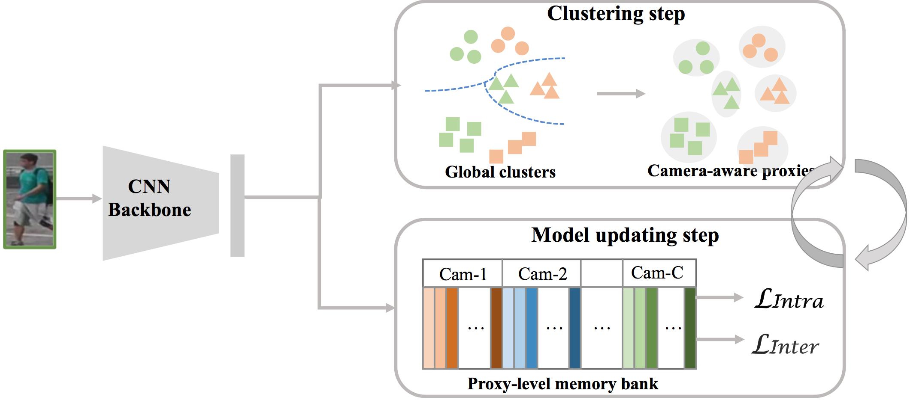
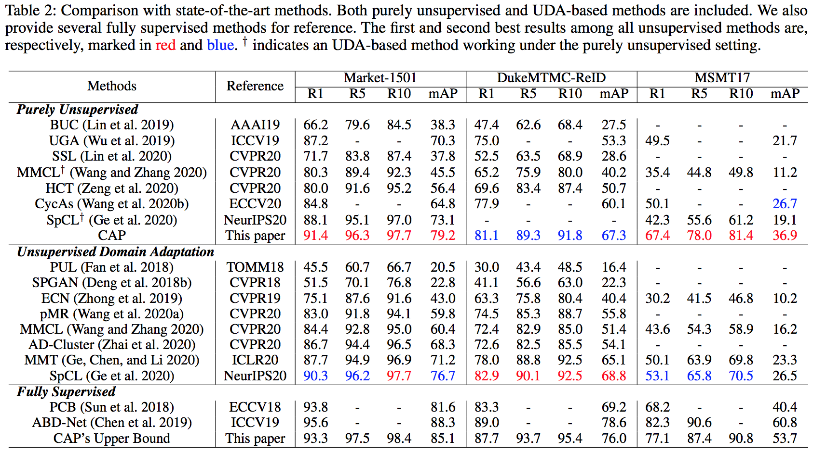

## Camera-aware Proxies for Unsupervised Person Re-Identification

The official implementation for [Camera-aware Proxies for Unsupervised Person Re-Identification](https://arxiv.org/abs/2012.10674), which is accepted by AAAI 2021.
**CAP** (Camera-Aware Proxies) achieves state-of-the-art performance on pure unsupervised person re-ID task. It can also be applied to unsupervised vehicle re-ID with competitive performance.



### Preparation

**Requirements: Pytorch>=1.1.0 and python>=3.6**

1. install [pytorch](https://pytorch.org/)
2. Download re-ID dataset 
   - [Market-1501](https://drive.google.com/file/d/0B8-rUzbwVRk0c054eEozWG9COHM/view)
   - [DukeMTMC-reID](https://drive.google.com/file/d/1jjE85dRCMOgRtvJ5RQV9-Afs-2_5dY3O/view)
   - [MSMT17](https://arxiv.org/abs/1711.08565)
   - [VeRi-776](https://github.com/JDAI-CV/VeRidataset)

3. Put the data under the dataset directory. Training, query and test sub-folder should named as bounding_box_train, query, bounding_box_test, respectively.

### Training and test model for unsupervised re-ID

```python
# train CAP model on Market-1501
CUDA_VISIBLE_DEVICES=0 python train_cap.py --target 'Market1501' --data_dir '/folder/to/dataset' --logs_dir 'Market_logs'

# test model on Market-1501
CUDA_VISIBLE_DEVICES=0 python train_cap.py --target 'Market1501' --data_dir '/folder/to/dataset' --logs_dir 'Market_logs' --evaluate True --load_ckpt 'trained_model_name.pth'
```

### Results



The performance of CAP on Vehicle re-ID dataset VeRi-776:

Rank-1 (\%)  | mAP (\%)
------------- | -------------
87.0  | 40.6

### Citation

If you find this work useful in your research, please cite the following paper:

```
@inproceedings{Wang2021camawareproxies,
  title={Camera-aware Proxies for Unsupervised Person Re-Identification},
  author={Menglin Wang and Baisheng Lai and Jianqiang Huang and Xiaojin Gong and Xian-Sheng Hua},
  booktitle={Proceedings of the AAAI Conference on Artificial Intelligence (AAAI)},
  year={2021},
}
```